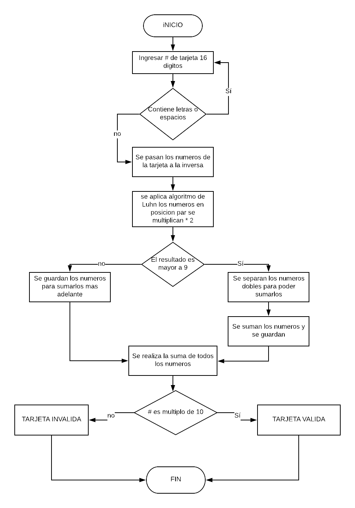

#  DESCRIPCION
CREA UNA WEB QUE PIDA POR MEDIO D EUN PROMPT EL NUMERO DE TRAJETA Y CONFIRMAR SU VALIDEZ SEGUN EL ALGORITMO DE LUHN.

# PSEUDOCODIGO
1. POR MEDIO DE UN PROMPT INGRESAR LOS 16 DIGITOS DE LA TARJETA.
2. SI SE INGRESA UNA LETRA O ESPACIO REGRESAR AL 1.
3. PASAR LOS NUMEROS A UN ARRAY DE MANERA INVERSA.
4. LOS NUMEROS QUE SE ENCUENTREN EN POSICIONES PARES MULTIPLICARLOS POR 2.
5. LOS QUE DEN NUMEROS MAYORES QUE 10 HACERLOS DE UNA CIFRA.
6. SUMAR TODOS LOS DIGITOS.
7. SI LA SUMA ES DIVISIBLE ENTRE 10 ES TARJETA VALIDA.

## DIAGRAMA DE FLUJO

